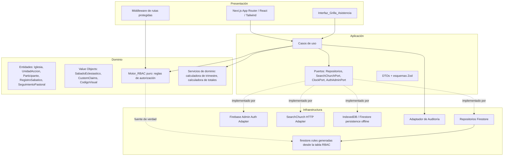
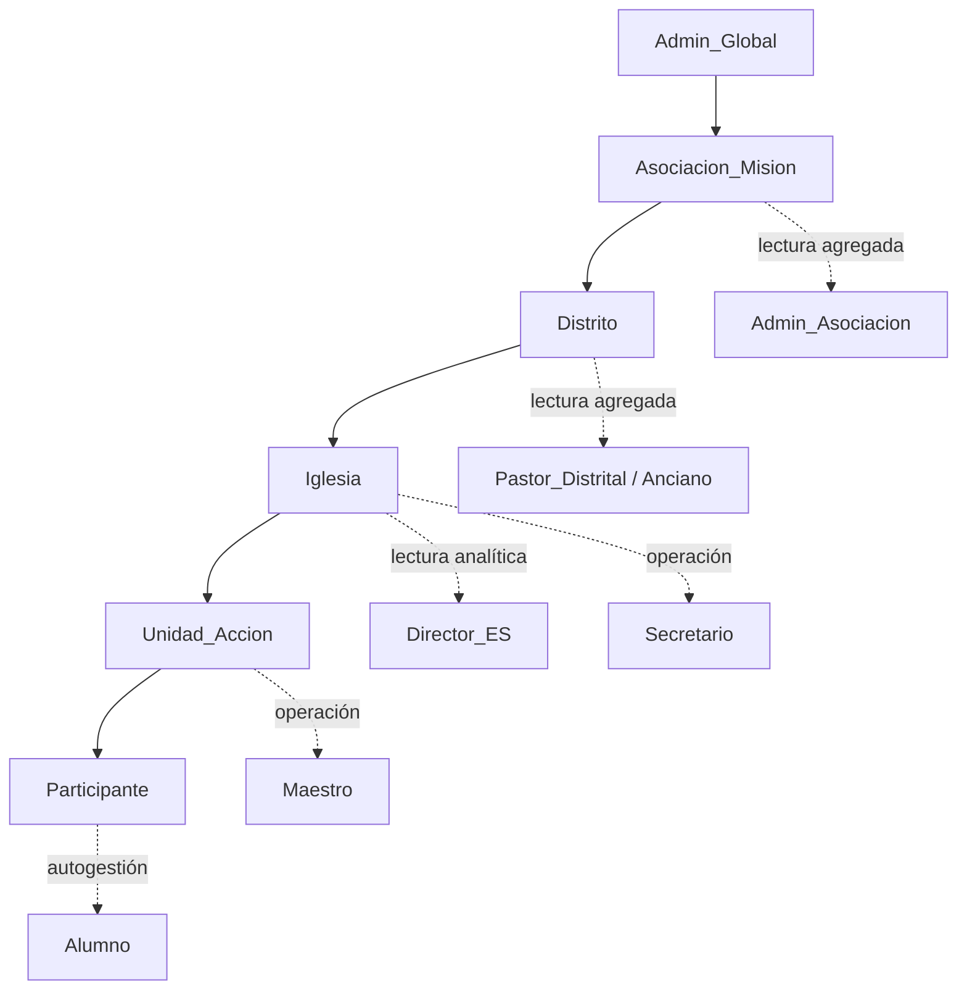
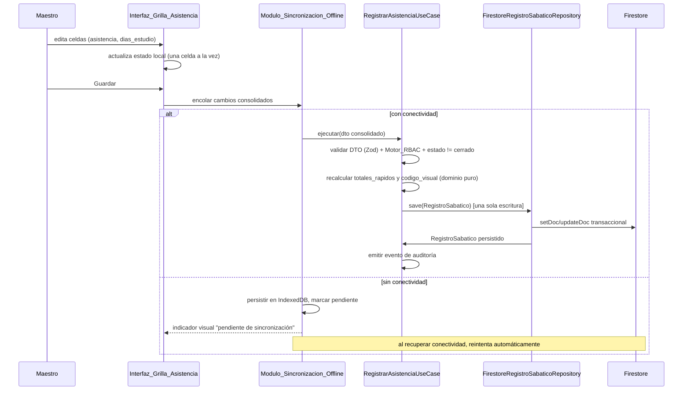
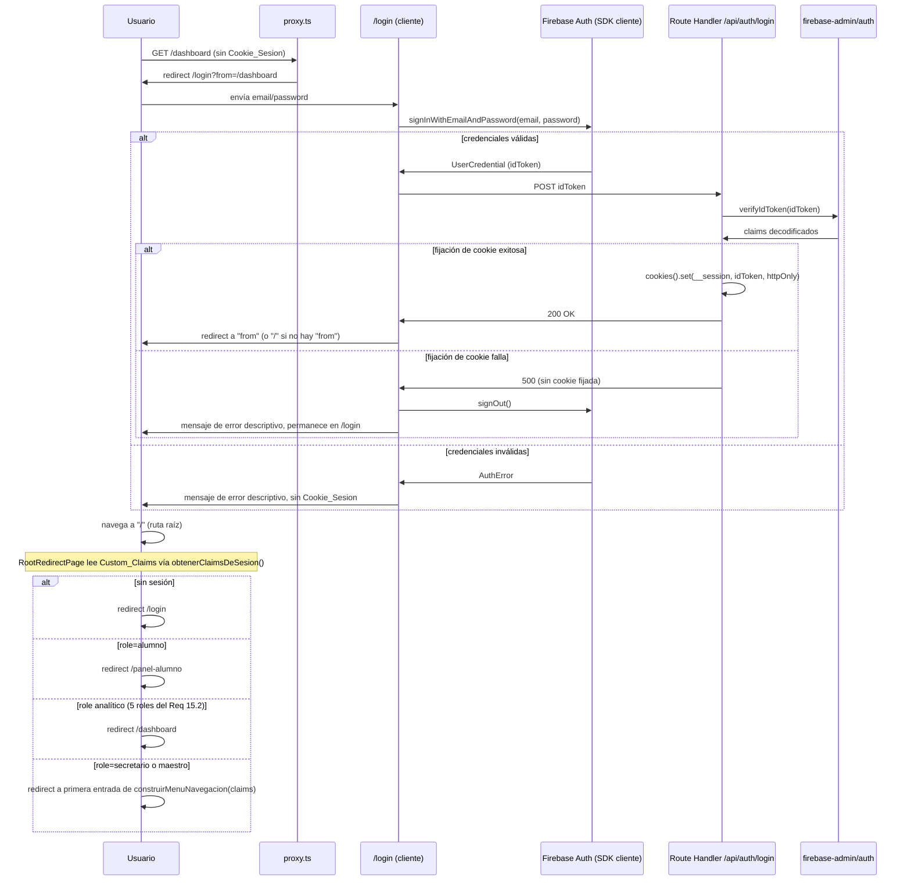

# Documento de Diseño: Maranatha Control

## Overview

Maranatha Control es un SaaS multitenant para la automatización y el pastoreo de la Escuela Sabática de la IASD. El diseño técnico traduce los 21 requerimientos funcionales en una arquitectura por capas (Clean Architecture + DDD) sobre Firebase, con un frontend Next.js/React/TypeScript/Tailwind, orientada a:

- **Aislamiento multitenant estricto** por `iglesia_id`, con consolidación de solo lectura hacia Distrito, Asociación/Misión y nivel Global.
- **Un motor de autorización único (Motor_RBAC)** cuya lógica se implementa una sola vez como funciones puras de dominio y se proyecta, sin duplicar reglas de negocio, tanto a la capa de Aplicación (casos de uso) como a las reglas de seguridad de Firestore.
- **Un documento agregado por Unidad de Acción y sábado** (`Registro_Sabatico`) que concentra asistencia, estudio diario y seguimiento pastoral en una sola escritura, para minimizar lecturas/escrituras de Firestore y sostener una grilla de alto rendimiento.
- **Puertos y adaptadores** para todo lo externo (SearchChurch, Firestore, Firebase Auth), de modo que el dominio y los casos de uso no dependan de Firebase.
- **Persistencia local y sincronización offline** para el flujo crítico de captura de asistencia en el salón de clase.

Este documento cubre las 24 secciones de requerimientos. Cada decisión de diseño enlaza explícitamente los requerimientos que satisface.

> **Nota de alcance (actualización)**: Las secciones marcadas explícitamente como "(Requirements 22-24)" en este documento cubren el inicio/cierre de sesión de usuario final, el enrutamiento y montaje real de los tres componentes de presentación ya implementados, y la configuración de entorno de Firebase. El resto del documento (Requirements 1-21) permanece sin cambios respecto a la versión previa de este diseño.

### Objetivos de diseño

1. La capa de Dominio es Firebase-agnóstica: puede probarse con Vitest/Jest sin emuladores.
2. Ninguna decisión de autorización se codifica dos veces: las reglas de Firestore (`firestore.rules`) y los casos de uso comparten la misma tabla de permisos declarativa, generada desde un único origen de verdad (ver `Componentes y interfaces > Motor_RBAC`).
3. El "Registro_Sabatico Core" se diseña primero para el caso de uso de mayor volumen de escritura (Requerimiento 7 y 14), evitando el patrón "una escritura por participante".
4. Todo cálculo temporal (trimestre, sábado eclesiástico) es una función pura parametrizada por zona horaria IANA, nunca por `Date` del servidor o del cliente (Requerimiento 20).

## Architecture

### Capas (Clean Architecture / DDD)



- **Dominio**: entidades, value objects, el Motor_RBAC (funciones puras `isAuthorizedForChurch`, `hasOperationalRole`, `canPerform`) y los servicios de cálculo (trimestre/sábado, totales de asistencia, código visual, deserción). No importa `firebase-admin`, `firebase`, ni Next.js. Satisface Requerimiento 19.1.
- **Aplicación**: casos de uso (`AsignarCustomClaims`, `RegistrarAsistencia`, `CerrarRegistroSabatico`, `RegistrarSeguimientoPastoral`, `AutorregistrarEstudioDiario`, `ConsultarDashboard`, `BuscarIglesiaOficial`, etc.), interfaces de repositorio (puertos) y esquemas Zod de DTOs de entrada. Cada caso de uso es una función/clase invocable desde una Route Handler de Next.js, desde una Cloud Function `onCall`, o desde un test, sin adaptación. Satisface Requerimientos 19.2 y 19.3.
- **Infraestructura**: implementaciones concretas de los puertos (`FirestoreIglesiaRepository`, `FirestoreRegistroSabaticoRepository`, `SearchChurchHttpAdapter`, `FirebaseAdminAuthAdapter`, `AuditoriaFirestoreAdapter`) y el módulo de sincronización offline.
- **Presentación**: rutas de Next.js App Router, componentes React (incluida la Interfaz_Grilla_Asistencia), middleware de rutas protegidas, hooks de acceso a casos de uso vía Server Actions/Route Handlers.

### Jerarquía territorial y multitenancy



Cada nodo de la jerarquía almacena únicamente el identificador de su padre inmediato (`iglesia.distrito_id`, `iglesia.asociacion_id`, `distrito.asociacion_id`). El Motor_RBAC resuelve la autorización jerárquica leyendo los Custom_Claims del token (`role`, `iglesia_id`, `distrito_id`, `asociacion_id`) contra los identificadores del recurso, sin necesidad de recorrer la jerarquía en cada consulta (los Custom_Claims llevan "desnormalizados" los tres niveles al momento de la asignación, Requerimiento 1).

### Flujo de escritura de alto rendimiento (Registro_Sabatico)



### Flujo de inicio de sesión y enrutamiento raíz (Requirements 22, 23)



## Components and Interfaces

### Dominio

**Entidades y Value Objects principales**

```typescript
// domain/entities/registro-sabatico.entity.ts
interface AsistenciaParticipante {
  presente: boolean;
  diasEstudio: number; // 0..7
  autorregistrado: boolean;
  codigoVisual: string; // "P7", "A", "F", "V"...
  seguimientoPastoral?: SeguimientoPastoral[];
}

interface TotalesRapidos {
  presentes: number;
  ausentes: number;
  visitas: number;
}

interface RegistroSabatico {
  id: string; // `${iglesia_id}_${unidad_id}_${anio}_T${trimestre}_S${sabado}`
  iglesiaId: string;
  unidadId: string;
  sabadoEclesiastico: SabadoEclesiastico;
  estado: "borrador" | "cerrado";
  asistencia: Record<string /* participanteId */, AsistenciaParticipante>;
  totalesRapidos: TotalesRapidos;
  cerradoPor?: string;
  fechaCierre?: Timestamp;
}
```

```typescript
// domain/value-objects/sabado-eclesiastico.vo.ts
interface SabadoEclesiastico {
  anio: number;
  numeroTrimestre: 1 | 2 | 3 | 4;
  numeroSabado: number; // 1..13
  fechaISO: string; // fecha calendario en TZ de la Iglesia
  timezone: string; // IANA, ej. "America/Santiago"
}
```

```typescript
// domain/value-objects/custom-claims.vo.ts
type Role =
  | "admin_global" | "admin_asociacion" | "pastor_distrital" | "anciano"
  | "director_es" | "secretario" | "maestro" | "alumno";

interface CustomClaims {
  role: Role;
  iglesiaId?: string;
  distritoId?: string;
  asociacionId?: string;
}
```

**Motor_RBAC (dominio puro, sin dependencias de Firebase)**

El Motor_RBAC se implementa como un módulo de funciones puras. Es el **único lugar** donde se codifica la matriz de permisos (Requerimiento 16). Tanto los casos de uso de Aplicación como el generador de `firestore.rules` importan esta tabla como fuente de verdad, satisfaciendo Requerimiento 19.4.

```typescript
// domain/services/rbac-engine.ts
type Resource =
  | "asociacion" | "distrito" | "iglesia" | "unidad_accion" | "participante"
  | "registro_sabatico" | "seguimiento_pastoral" | "dashboard" | "auditoria"
  | "custom_claims" | "datos_personales";

type Operation = "crear" | "leer" | "actualizar" | "eliminar" | "listar";

interface ResourceScope {
  iglesiaId?: string;
  distritoId?: string;
  asociacionId?: string;
}

// Tabla declarativa: única fuente de verdad de la Matriz RBAC (Requerimiento 16)
const PERMISSION_MATRIX: PermissionRule[] = [ /* ... */ ];

function isAuthorizedForChurch(claims: CustomClaims, iglesiaId: string): boolean;
function hasOperationalRole(claims: CustomClaims): boolean; // {secretario, maestro, director_es}
function canPerform(claims: CustomClaims, resource: Resource, operation: Operation, scope: ResourceScope): boolean;
function visibleNavSections(claims: CustomClaims): NavSection[]; // Requerimiento 15.4
```

- `isAuthorizedForChurch` implementa Requerimiento 12.1/12.2: verdadero si `role === "admin_global"`, o si `iglesiaId` coincide, o si el `distritoId`/`asociacionId` del token es ancestro jerárquico de la iglesia del recurso (resuelto contra un índice ligero de `distrito_id`/`asociacion_id` por iglesia, cacheado en el propio Custom_Claims del actor o consultado una vez por request).
- `canPerform` es la función que consumen tanto los casos de uso como el generador de reglas de Firestore.

### Aplicación

**Estructura de casos de uso** (uno por operación de negocio, Requerimiento 19.3):

```
application/
  use-cases/
    auth/
      asignar-custom-claims.use-case.ts        // Req 1.1-1.5
      canjear-codigo-enlace.use-case.ts          // Req 1.7-1.8
    territorio/
      crear-asociacion.use-case.ts              // Req 2.1
      crear-distrito.use-case.ts                 // Req 2.2
      crear-iglesia.use-case.ts                  // Req 3.1-3.6
      eliminar-iglesia.use-case.ts               // Req 3.8
      buscar-iglesia-oficial.use-case.ts         // Req 4.1-4.4
    unidades/
      crear-unidad-accion.use-case.ts            // Req 5.1-5.4
      listar-unidades-por-maestro.use-case.ts    // Req 5.6
    participantes/
      crear-participante.use-case.ts             // Req 6.1-6.4
      generar-codigo-enlace.use-case.ts           // Req 6.7
    registro-sabatico/
      registrar-asistencia.use-case.ts            // Req 7.1-7.7, 7.10, 14.4
      cerrar-registro-sabatico.use-case.ts         // Req 8.1, 8.3
      reabrir-registro-sabatico.use-case.ts        // Req 8.1, 8.3
      eliminar-registro-sabatico.use-case.ts       // Req 7.9
      registrar-seguimiento-pastoral.use-case.ts   // Req 9.1-9.4
      autorregistrar-estudio-diario.use-case.ts    // Req 10.1-10.5
    dashboard/
      consultar-dashboard.use-case.ts              // Req 11.1-11.7
    auditoria/
      consultar-auditoria.use-case.ts              // Req 13.3-13.5
    privacidad/
      exportar-datos-participante.use-case.ts      // Req 21.3-21.4
      eliminar-datos-participante.use-case.ts      // Req 21.3-21.4
  ports/
    iglesia.repository.port.ts
    unidad-accion.repository.port.ts
    participante.repository.port.ts
    registro-sabatico.repository.port.ts
    seguimiento-pastoral.repository.port.ts
    auditoria.repository.port.ts
    search-church.port.ts
    auth-admin.port.ts
    clock.port.ts               // reloj inyectable para pruebas deterministas
  dto/
    *.schema.ts                 // esquemas Zod, Req 17.1
```

Cada caso de uso sigue la misma forma canónica:

```typescript
async function execute(actorClaims: CustomClaims, input: unknown): Promise<Result<Output, DomainError>> {
  const dto = InputSchema.safeParse(input);               // Req 17.1
  if (!dto.success) return err(validationError(dto.error)); // Req 17.2 (sin efectos colaterales)

  if (!canPerform(actorClaims, resource, operation, scopeOf(dto.data))) {
    return err(authorizationError());                      // Req 12, 16
  }

  // reglas de negocio de dominio (estado, rangos, unicidad...)
  const domainResult = domainService.apply(dto.data, currentState);
  if (isErr(domainResult)) return domainResult;

  const saved = await repo.save(domainResult.value);        // única escritura consolidada
  await auditoria.registrar({ uid: actorClaims.uid, accion, recursoAfectado, iglesiaId }); // Req 13.1
  return ok(saved);
}
```

Este esqueleto único garantiza que **toda** mutación pasa por: validación Zod → autorización RBAC → regla de dominio → persistencia → auditoría, en ese orden, sin excepciones. Esto es la base de las Correctness Properties de validación/autorización/auditoría transversales.

**Puerto SearchChurch (puerto/adaptador DDD, Requerimiento 4)**

```typescript
// application/ports/search-church.port.ts
interface IglesiaOficial {
  idOficial: string;
  nombre: string;
  paisCodigo: string;
}

interface SearchChurchPort {
  buscar(criterio: string): Promise<IglesiaOficial[]>; // debe resolver o lanzar SearchChurchTimeoutError a los 10s
}
```

La implementación (`infrastructure/adapters/search-church-http.adapter.ts`) es una Cloud Function `onCall` intermedia: recibe el criterio, agrega credenciales de la API SearchChurch desde variables de entorno del servidor (nunca enviadas al cliente), aplica un `AbortController` con timeout de 10s, y traduce la respuesta externa a `IglesiaOficial[]`. El caso de uso `BuscarIglesiaOficialUseCase` solo conoce el puerto, no el adaptador, por lo que puede probarse con un `InMemorySearchChurchPort` de prueba.

### Infraestructura

**Repositorios Firestore** — cada uno implementa el puerto correspondiente y encapsula el mapeo documento ↔ entidad de dominio. El `FirestoreRegistroSabaticoRepository.save()` ejecuta una única `setDoc`/`updateDoc` sobre el documento agregado (Requerimiento 7.1, 14.4), usando el ID determinístico `{iglesia_id}_{unidad_id}_{año}_T{trimestre}_S{sabado}` para permitir `upsert` idempotente.

**Reglas de seguridad de Firestore** — generadas/derivadas de `PERMISSION_MATRIX` (no escritas a mano de forma independiente), de modo que un cambio en la matriz de permisos se refleje en ambos lados. Ejemplo conceptual:

```
function isAuthorizedForChurch(iglesiaId) {
  return request.auth.token.role == 'admin_global'
    || request.auth.token.iglesia_id == iglesiaId
    || get(/databases/$(database)/documents/iglesias/$(iglesiaId)).data.distrito_id == request.auth.token.distrito_id
    || get(/databases/$(database)/documents/iglesias/$(iglesiaId)).data.asociacion_id == request.auth.token.asociacion_id;
}
match /registros_sabaticos/{regId} {
  allow read: if isAuthorizedForChurch(resource.data.iglesia_id);
  allow create, update: if hasOperationalRole() && isAuthorizedForChurch(request.resource.data.iglesia_id)
                          && resource.data.estado != 'cerrado';
  allow delete: if request.auth.token.role == 'admin_global';
}
```

**Adaptador de Auditoría** — escribe en `/auditoria/{eventoId}` con reglas de Firestore que prohíben `update`/`delete` para cualquier rol distinto de `admin_global` (Requerimiento 13.2), garantizando inmutabilidad incluso ante un bug de la capa de Aplicación.

**Módulo de Sincronización Offline** — usa la persistencia offline nativa de Firestore (IndexedDB) como transporte base, complementada con una cola de comandos propia (`OfflineQueue`) para los casos de uso de escritura consolidada de la grilla. Al reconectar, la cola reintenta en orden FIFO; si el servidor responde que el `RegistroSabatico` remoto está `cerrado`, el comando se marca `en_conflicto` y se notifica al Maestro (Requerimiento 18.3) en lugar de aplicarse silenciosamente.

### Presentación

**Interfaz_Grilla_Asistencia (Requerimiento 14)**

- Virtualización de filas (`@tanstack/react-virtual` o equivalente) para soportar hasta 200 participantes con renderizado inicial &lt;2s en redes de 3 Mbps: solo se montan en el DOM las filas visibles.
- Estado local de la grilla modelado como `Record<participanteId, CeldaState>` con actualizaciones granulares vía `useReducer`/store atómico (Zustand/Jotai): al modificar una celda solo se dispara un re-render del componente de esa fila (React.memo + selector por clave), nunca de la lista completa.
- Navegación por teclado: un hook `useGridKeyboardNav` captura `ArrowUp/Down/Left/Right`, `Tab`/`Shift+Tab`, `Enter`, y mueve el foco DOM entre celdas (`role="gridcell"`, `tabIndex` gestionado), sin depender del mouse.
- Guardado: un único botón "Guardar" recolecta el diff acumulado (`Map<participanteId, CambioParcial>`) desde la última sincronización y lo envía como **un solo DTO consolidado** al caso de uso `RegistrarAsistenciaUseCase`.
- Accesibilidad: controles con `aria-label`, contraste de color verificado contra WCAG 2.1 AA en tokens de Tailwind (fondo/texto), navegación de foco visible. La validación final de accesibilidad requiere revisión manual con lector de pantalla además de linting automatizado (axe-core en CI).

**Rutas protegidas (Requerimiento 15)**

- Middleware de Next.js (`middleware.ts`) verifica sesión de Firebase Auth en cada request a rutas del segmento `(protected)`; si no hay sesión, redirige a `/login`.
- Cada layout de sección invoca `canPerform(claims, resource, "leer", scope)`; si es falso, renderiza una vista de "Acceso denegado" en vez de la sección.
- El menú de navegación se construye con `visibleNavSections(claims)`, ocultando entradas sin permiso (Requerimiento 15.4), usando la misma tabla `PERMISSION_MATRIX` que el backend.

### Enrutamiento, login y logout (Requirements 22, 23)

**Árbol de rutas del App Router**

Los tres componentes de presentación ya implementados (`DashboardAnalitico`, `PanelAlumno`, `InterfazGrillaAsistencia`) son componentes puros que reciben datos ya resueltos por props; su montaje real consiste en crear, para cada uno, una `page.tsx` que resuelve el caso de uso correspondiente y les pasa el resultado, envuelta en el layout del segmento protegido. Se usa un Route Group `(protected)` (convención de Next.js: una carpeta entre paréntesis no se incluye en la URL) para que un único `layout.tsx` construya la navegación una sola vez para todas las rutas protegidas, sin afectar la ruta pública `/login`:

```
src/app/
  layout.tsx                          // Root layout (existente, sin cambios de negocio)
  page.tsx                            // Ruta raíz "/": RootRedirectPage (Requirement 23.4-23.7)
  login/
    page.tsx                          // Formulario de login (cliente), lee ?from= (Requirement 22)
  api/
    auth/
      login/
        route.ts                     // POST: verifica idToken, fija Cookie_Sesion (Requirement 22.1, 22.2, 22.7)
      logout/
        route.ts                     // POST: elimina Cookie_Sesion (Requirement 22.3)
  (protected)/
    layout.tsx                       // invoca obtenerClaimsDeSesion() + construirMenuNavegacion(claims) (Requirement 23.3)
    dashboard/
      page.tsx                       // <SectionGuard resource="dashboard"><DashboardAnalitico .../></SectionGuard>
    panel-alumno/
      page.tsx                       // <SectionGuard resource="participante"><PanelAlumno .../></SectionGuard>
    unidades/[unidadId]/registro/
      page.tsx                       // <SectionGuard resource="registro_sabatico"><InterfazGrillaAsistencia .../></SectionGuard>
    iglesias/... , distritos/..., asociaciones/..., participantes/..., auditoria/...
                                      // demás secciones de Requirements 1-13 (fuera del alcance de esta actualización)
```

- `(protected)/layout.tsx` es el único punto donde se invoca `construirMenuNavegacion(claims)` (Requirement 23.3); cada `page.tsx` de sección individual invoca además su propio `SectionGuard` con el `resource` correspondiente (Requirement 23.2), replicando el patrón ya usado por `SectionGuard`/`AccesoDenegado` (ver `Presentación > Rutas protegidas` más arriba) — la responsabilidad de "ocultar del menú" (layout) y "denegar el contenido" (guard por página) permanecen deliberadamente separadas, igual que en el Requirement 15.
- `InterfazGrillaAsistencia` requiere un segmento dinámico (`[unidadId]`) porque opera sobre una Unidad_Accion concreta; las rutas de `DashboardAnalitico` y `PanelAlumno` no requieren parámetros de ruta porque el caso de uso subyacente ya resuelve el alcance a partir de los Custom_Claims del actor (Property 30, Property 29).
- El `matcher` de `proxy.ts` (`PREFIJOS_PROTEGIDOS`) debe extenderse para incluir `/panel-alumno` (ya cubre `/dashboard`, y las rutas de Unidad/Registro bajo `/unidades`), de modo que la verificación optimista de sesión (Requirement 15.1) también aplique a la ruta del Alumno.

**Página raíz `/` (Requirement 23.4-23.7)**

```typescript
// app/page.tsx (Server Component)
export default async function RootRedirectPage(): Promise<never> {
  const claims = await obtenerClaimsDeSesion();

  if (claims === null) {
    redirect("/login");                                 // Requirement 23.7
  }
  if (claims.role === "alumno") {
    redirect("/panel-alumno");                            // Requirement 23.4
  }
  if (ROLES_ANALITICOS.includes(claims.role)) {          // los 5 roles del Requirement 15.2
    redirect("/dashboard");                               // Requirement 23.5
  }
  // claims.role es "secretario" | "maestro" en este punto (admin_global cae en ROLES_ANALITICOS)
  const menu = construirMenuNavegacion(claims);
  redirect(menu[0]?.href ?? "/login");                    // Requirement 23.6
}
```

`resolverDestinoRaiz(claims)` (la función pura que decide el destino sin ejecutar el `redirect()` en sí) se extrae a `presentation/root-redirect.ts` para permitir probarla como propiedad sin necesitar un entorno de Next.js real.

**Flujo de login (Requirement 22.1, 22.2, 22.4, 22.5, 22.7)**

El formulario de `/login` es un componente de cliente que usa el SDK cliente de Firebase Auth (`signInWithEmailAndPassword`) directamente — no un Server Action — porque Firebase Auth gestiona el estado de sesión del cliente (`onAuthStateChanged`, refresco silencioso de tokens) exclusivamente a través del SDK cliente; el ID token resultante se envía después a un Route Handler para fijar la Cookie_Sesion del lado servidor:

```typescript
// app/login/page.tsx (Client Component, extracto)
async function manejarSubmit(email: string, password: string, from: string | null) {
  try {
    const credencial = await signInWithEmailAndPassword(firebaseAuthClient, email, password); // Req 22.1, 22.2
    const idToken = await credencial.user.getIdToken();

    const respuesta = await fetch("/api/auth/login", {
      method: "POST",
      body: JSON.stringify({ idToken }),
    });

    if (!respuesta.ok) {
      await signOut(firebaseAuthClient);                 // Req 22.7: revertir sesión de cliente
      mostrarError("No se pudo completar el inicio de sesión.");
      return;
    }

    router.push(from ?? "/");                             // Req 22.4 (from) / 22.5 (raíz)
  } catch (error) {
    mostrarError(mensajeDeErrorLegible(error));           // Req 22.2: sin fijar Cookie_Sesion
  }
}
```

```typescript
// app/api/auth/login/route.ts (Route Handler)
export async function POST(request: Request): Promise<Response> {
  const { idToken } = LoginRequestSchema.parse(await request.json()); // Req 17.1

  let claims: CustomClaims;
  try {
    claims = await verificarIdToken(idToken);             // firebase-admin, valida firma+expiración
  } catch {
    return Response.json({ error: "token inválido" }, { status: 401 });
  }

  try {
    const cookieStore = await cookies();
    cookieStore.set(COOKIE_SESION, idToken, {
      httpOnly: true,
      secure: true,
      sameSite: "lax",
      path: "/",
      maxAge: SESION_MAX_AGE_SEGUNDOS,
    });
  } catch {
    return Response.json({ error: "no se pudo fijar la sesión" }, { status: 500 }); // Req 22.7
  }

  return Response.json({ uid: claims.uid });
}
```

Nótese que la validación `from` no se procesa en el Route Handler: el Route Handler solo fija la cookie y responde; la decisión de a dónde redirigir (`from` vs. `/`) ocurre enteramente en el cliente (`app/login/page.tsx`), que ya recibió `from` como `searchParams` de la propia navegación a `/login` (el mismo parámetro que `proxy.ts` fija al redirigir, ver `src/proxy.ts`). Esto evita que el Route Handler necesite validar `from` como una URL de redirección abierta (open redirect): el único lugar que interpreta `from` es el propio cliente que lo recibió de su propia URL.

**Logout (Requirement 22.3)**

```typescript
// app/api/auth/logout/route.ts (Route Handler)
export async function POST(): Promise<Response> {
  const cookieStore = await cookies();
  cookieStore.delete(COOKIE_SESION);
  return Response.json({ ok: true });
}
```

El botón de logout (componente de cliente, en el layout `(protected)`) invoca `POST /api/auth/logout`, luego `signOut(firebaseAuthClient)` (para limpiar también el estado del SDK cliente) y finalmente `router.push("/login")`.

### Inicialización de Firebase (Requirement 24)

Dos módulos de infraestructura, uno por lado de ejecución, cada uno con validación explícita de variables de entorno al inicializar (nunca una inicialización parcial):

```typescript
// infrastructure/firebase-client.ts ("use client" o importado solo desde código de cliente)
import { initializeApp, getApps, type FirebaseOptions } from "firebase/app";
import { getAuth } from "firebase/auth";

const VARIABLES_CLIENTE = [
  "NEXT_PUBLIC_FIREBASE_API_KEY",
  "NEXT_PUBLIC_FIREBASE_AUTH_DOMAIN",
  "NEXT_PUBLIC_FIREBASE_PROJECT_ID",
  "NEXT_PUBLIC_FIREBASE_STORAGE_BUCKET",
  "NEXT_PUBLIC_FIREBASE_MESSAGING_SENDER_ID",
  "NEXT_PUBLIC_FIREBASE_APP_ID",
] as const;

function leerConfigClienteOLanzar(): FirebaseOptions {
  const valores: Partial<Record<(typeof VARIABLES_CLIENTE)[number], string>> = {};
  for (const nombre of VARIABLES_CLIENTE) {
    const valor = process.env[nombre];
    if (valor === undefined || valor.length === 0) {
      throw new Error(`Falta la variable de entorno requerida: ${nombre}`); // Req 24.5
    }
    valores[nombre] = valor;
  }
  return {
    apiKey: valores.NEXT_PUBLIC_FIREBASE_API_KEY,
    authDomain: valores.NEXT_PUBLIC_FIREBASE_AUTH_DOMAIN,
    projectId: valores.NEXT_PUBLIC_FIREBASE_PROJECT_ID,
    storageBucket: valores.NEXT_PUBLIC_FIREBASE_STORAGE_BUCKET,
    messagingSenderId: valores.NEXT_PUBLIC_FIREBASE_MESSAGING_SENDER_ID,
    appId: valores.NEXT_PUBLIC_FIREBASE_APP_ID,
  } as FirebaseOptions;
}

const app = getApps()[0] ?? initializeApp(leerConfigClienteOLanzar());
export const firebaseAuthClient = getAuth(app);
```

```typescript
// infrastructure/firebase-admin.ts (solo importado desde código de servidor: Route Handlers, casos de uso)
import "server-only"; // Req 24.3: falla el build si este módulo se importa desde código de cliente
import { initializeApp, getApps, cert } from "firebase-admin/app";
import { getAuth } from "firebase-admin/auth";

const VARIABLES_SERVIDOR = [
  "FIREBASE_ADMIN_PROJECT_ID",
  "FIREBASE_ADMIN_CLIENT_EMAIL",
  "FIREBASE_ADMIN_PRIVATE_KEY",
] as const;

function leerCredencialServidorOLanzar() {
  const valores: Partial<Record<(typeof VARIABLES_SERVIDOR)[number], string>> = {};
  for (const nombre of VARIABLES_SERVIDOR) {
    const valor = process.env[nombre];
    if (valor === undefined || valor.length === 0) {
      throw new Error(`Falta la variable de entorno requerida: ${nombre}`); // Req 24.5
    }
    valores[nombre] = valor;
  }
  return {
    projectId: valores.FIREBASE_ADMIN_PROJECT_ID,
    clientEmail: valores.FIREBASE_ADMIN_CLIENT_EMAIL,
    privateKey: valores.FIREBASE_ADMIN_PRIVATE_KEY?.replace(/\\n/g, "\n"),
  };
}

const app = getApps()[0] ?? initializeApp({ credential: cert(leerCredencialServidorOLanzar()) });
export const firebaseAdminAuth = getAuth(app);
```

- El paquete `server-only` (ya usado como patrón documentado por Next.js para session management, ver guía de autenticación) garantiza en tiempo de build que ningún componente de cliente importe accidentalmente `firebase-admin.ts`, reforzando en la propia cadena de módulos la garantía del Requerimiento 24.3 (además de que `firebase-admin` como paquete Node.js ya fallaría en el bundle del navegador).
- Ambos módulos lanzan un `Error` con el nombre exacto de la variable faltante — nunca continúan con una inicialización parcial (Requerimiento 24.5) — y ambos se limitan estrictamente al conjunto de variables listado (Requerimiento 24.1, 24.2), que coincide exactamente con las claves de `.env.example` (Requerimiento 24.4).
- `verificarIdToken(idToken)` (usado por `app/api/auth/login/route.ts`) es una función delgada sobre `firebaseAdminAuth.verifyIdToken(idToken)` que traduce el resultado a `CustomClaims`, reutilizando el mismo tipo de dominio que `AuthAdminPort`.

## Data Models

Todas las colecciones incluyen `creadoEn`/`actualizadoEn` (server timestamp) y los documentos afectados por Requerimiento 13 disparan un evento de auditoría desde el caso de uso, no desde un trigger de Firestore (para mantener la escritura y el registro de auditoría bajo el mismo control transaccional de la capa de Aplicación).

```
/asociaciones/{asociacion_id}
  nombre: string
  paisCodigo: string
  creadoEn: Timestamp

/distritos/{distrito_id}
  nombre: string
  asociacionId: string
  supervisorUid?: string        // pastor_distrital o anciano
  creadoEn: Timestamp

/iglesias/{iglesia_id}          // id_oficial funciona como iglesia_id
  idOficial: string
  nombre: string
  asociacionId: string
  distritoId: string
  paisCodigo: string
  timezone?: string             // IANA; ausente => bloquea creación de RegistroSabatico (Req 20.3)
  fechaAlta: Timestamp
  creadoEn: Timestamp

/unidades_accion/{unidad_id}
  iglesiaId: string
  nombre: string
  maestroUid: string
  estado: "activa" | "inactiva"
  creadoEn: Timestamp

/participantes/{participante_id}
  iglesiaId: string
  unidadId: string
  nombre: string
  apellido: string
  esVisita: boolean
  esMenorEdad?: boolean          // nunca expuesto en agregados (Req 21.1)
  estado: "activo" | "inactivo"
  userUid?: string               // vínculo de Alumno
  codigoEnlace?: { codigo: string; usado: boolean; emitidoPor: string; emitidoEn: Timestamp }
  creadoEn: Timestamp

/registros_sabaticos/{iglesia_id}_{unidad_id}_{anio}_T{trimestre}_S{sabado}
  iglesiaId: string
  unidadId: string
  sabadoEclesiastico: { anio, numeroTrimestre, numeroSabado, fechaISO, timezone }
  estado: "borrador" | "cerrado"
  asistencia: {
    [participanteId]: {
      presente: boolean
      diasEstudio: number        // 0..7
      autorregistrado: boolean
      codigoVisual: string
      seguimientoPastoral: [ { accion, registradoPor, registradoEn } ]
    }
  }
  totalesRapidos: { presentes: number, ausentes: number, visitas: number }
  cerradoPor?: string
  fechaCierre?: Timestamp
  creadoEn: Timestamp
  actualizadoEn: Timestamp

/auditoria/{evento_id}
  uid: string
  accion: string
  recursoAfectado: string
  iglesiaId?: string
  timestamp: Timestamp           // server timestamp, inmutable

/enlaces_pendientes/{codigo}     // colección auxiliar para códigos de enlace de Alumno
  participanteId: string
  usado: boolean
  emitidoPor: string
  emitidoEn: Timestamp
```

Decisiones clave:

- **`Registro_Sabatico` como agregado único** por Unidad+sábado (no una colección de asistencias por participante): esto es lo que permite la escritura consolidada del Requerimiento 7.1/14.4 y hace posible que `totalesRapicos` (presentes/ausentes/visitas) y `codigoVisual` se recalculen en memoria dentro del caso de uso y se persistan en la misma operación.
- **ID determinístico** del documento `RegistroSabatico`: hace que "crear si no existe, actualizar si existe" sea un solo `upsert` idempotente, evitando condiciones de carrera al crear duplicados para el mismo sábado.
- **`Seguimiento_Pastoral` embebido** dentro de `asistencia[participanteId]` (no colección separada): se lee y escribe siempre junto con el registro del sábado, y respeta automáticamente el bloqueo de `estado=cerrado` (Requerimiento 8.4, 9.4).
- **`enlaces_pendientes` separada de `participantes`**: permite que las reglas de Firestore validen el canje (`usado=false`) sin exponer el resto de los datos del participante a un cliente no autenticado todavía.

## Correctness Properties

*Una propiedad es una característica o comportamiento que debe cumplirse en todas las ejecuciones válidas del sistema; en esencia, una afirmación formal sobre lo que el sistema debe hacer. Las propiedades sirven de puente entre las especificaciones legibles por humanos y las garantías de corrección verificables por máquina.*

Estas propiedades surgen del análisis de prework sobre las 21 secciones de requerimientos, tras una fase de reflexión que consolidó los criterios de aceptación redundantes (por ejemplo, todas las variantes de "lectura solo si el Motor_RBAC autoriza" se unificaron en la Propiedad 1; todas las variantes de "inmutabilidad si `estado=cerrado`" se unificaron en la Propiedad 19).

### Property 1: Autorización territorial de lectura y listado
Para todo actor con Custom_Claims y todo recurso (Iglesia, Unidad_Accion, Participante, Registro_Sabatico, Seguimiento_Pastoral) con una `iglesia_id`, la operación de lectura o listado SHALL ser permitida si y solo si `isAuthorizedForChurch(claims, iglesia_id)` es verdadero, y ningún resultado de una consulta de listado SHALL incluir documentos de una `iglesia_id` no autorizada, incluso si el actor provee filtros de consulta arbitrarios.
**Validates: Requirements 3.7, 5.5, 7.8, 9.5, 12.1, 12.2, 12.5**

### Property 2: Autorización territorial de creación y escritura operativa
Para todo actor con rol `secretario`, `maestro` o `admin_global` y todo intento de crear o modificar una Unidad_Accion, Participante o Registro_Sabatico, la operación SHALL ser permitida si y solo si la `iglesia_id` del recurso coincide exactamente con la `iglesia_id` de los Custom_Claims del actor (o el actor es `admin_global`).
**Validates: Requirements 5.1, 5.2, 6.1, 6.2, 7.3, 12.3, 12.4, 16.3, 16.4**

### Property 3: Autorización de asignación de Custom_Claims por alcance del actor
Para todo actor y todo usuario destino, la asignación de Custom_Claims SHALL ser permitida si y solo si el actor tiene `role=admin_global`, o el actor tiene `role=admin_asociacion` y la `asociacion_id` objetivo coincide con la `asociacion_id` de su propio token; en cualquier otro caso SHALL ser rechazada con un error de autorización.
**Validates: Requirements 1.1, 1.2, 1.3**

### Property 4: Rechazo de rol inválido en asignación de Custom_Claims
Para todo valor de `role` que no pertenezca al conjunto {admin_global, admin_asociacion, pastor_distrital, anciano, director_es, secretario, maestro, alumno}, la asignación de Custom_Claims SHALL ser rechazada con un error de validación y los Custom_Claims del usuario destino SHALL permanecer sin cambios.
**Validates: Requirements 1.4**

### Property 5: Invalidación de sesión tras actualización de Custom_Claims
Para toda asignación exitosa de Custom_Claims sobre un usuario destino, el sistema SHALL invocar la invalidación del token de sesión vigente de ese usuario exactamente una vez, independientemente de los valores concretos de `role`/`iglesia_id`/`distrito_id`/`asociacion_id` asignados.
**Validates: Requirements 1.5**

### Property 6: Round-trip de código de enlace de un solo uso
Para todo Participante sin `user_uid`, generar un código de enlace y luego canjearlo con un Alumno SHALL vincular el `user_uid` del Alumno al Participante y asignar `role=alumno` con la `iglesia_id` del Participante; y para todo código ya usado o inexistente, el canje SHALL ser rechazado sin modificar ningún Participante.
**Validates: Requirements 1.7, 1.8, 6.7**

### Property 7: Autorización de creación territorial de nivel superior
Para todo actor y toda Asociacion_Mision, Distrito o Iglesia a crear, la operación SHALL ser permitida si y solo si el actor tiene `role=admin_global`, o tiene `role=admin_asociacion` y la `asociacion_id` del recurso coincide con la de su propio token; y toda creación de Distrito referenciando una `asociacion_id` inexistente SHALL ser rechazada con un error de validación.
**Validates: Requirements 2.1, 2.2, 2.3, 2.4, 3.1, 3.2, 3.3, 3.5, 16.1**

### Property 8: Unicidad de `id_oficial` de Iglesia
Para toda secuencia de creación de Iglesias, si dos operaciones utilizan el mismo `id_oficial`, la segunda SHALL ser rechazada con un error de validación de duplicado y el estado de la primera Iglesia SHALL permanecer inalterado.
**Validates: Requirements 3.4**

### Property 9: Restricción de eliminación permanente a Admin_Global
Para toda Iglesia o Registro_Sabatico y todo actor cuyo `role` no sea `admin_global`, la operación de eliminación permanente SHALL ser rechazada con un error de autorización.
**Validates: Requirements 3.8, 7.9**

### Property 10: Edición autorizada de campos de Iglesia
Para todo actor autorizado sobre una Iglesia (según Propiedad 1) con `role` en {admin_global, admin_asociacion}, editar `nombre`, `distrito_id` o `pais_codigo` SHALL actualizar únicamente esos campos y preservar el resto del documento sin cambios.
**Validates: Requirements 3.6**

### Property 11: El adaptador SearchChurch nunca expone credenciales al cliente
Para toda invocación exitosa o fallida del adaptador SearchChurch, la respuesta serializada retornada al cliente SHALL no contener ningún campo de credencial, token o cabecera de autenticación de la API externa.
**Validates: Requirements 4.1**

### Property 12: Mapeo de resultado SearchChurch a borrador de Iglesia
Para todo resultado de búsqueda retornado por SearchChurch, seleccionarlo para importar SHALL producir un borrador de Iglesia cuyos campos `id_oficial`, `nombre` y `pais_codigo` sean exactamente iguales a los del resultado seleccionado.
**Validates: Requirements 4.2**

### Property 13: Autorización de búsqueda SearchChurch
Para todo actor cuyo `role` no sea `admin_global` ni `admin_asociacion`, invocar la búsqueda de SearchChurch SHALL ser rechazado con un error de autorización.
**Validates: Requirements 4.4**

### Property 14: Rechazo de roles no operativos sobre Unidad_Accion
Para todo actor cuyo `role` sea `director_es`, `pastor_distrital`, `anciano` o `alumno`, todo intento de crear, editar o eliminar una Unidad_Accion SHALL ser rechazado con un error de autorización.
**Validates: Requirements 5.3**

### Property 15: Filtro de Unidades por maestro asignado
Para todo Maestro y toda colección de Unidades_Accion, consultar "mis Unidades" SHALL retornar exactamente el subconjunto cuyo `maestro_uid` es igual al `uid` del token del Maestro, y ningún elemento adicional.
**Validates: Requirements 5.6**

### Property 16: Validación referencial de Participante contra su Unidad
Para todo intento de crear un Participante con una `unidad_id` cuya `iglesia_id` asociada difiere de la `iglesia_id` provista para el Participante, la operación SHALL ser rechazada con un error de validación.
**Validates: Requirements 6.3**

### Property 17: Exclusión de Participantes inactivos de nuevos Registros
Para toda Unidad_Accion y todo Participante marcado `estado=inactivo` antes de la creación de un nuevo Registro_Sabatico, ese Participante SHALL estar ausente del mapa `asistencia` del nuevo Registro_Sabatico generado.
**Validates: Requirements 6.4**

### Property 18: Invariante contable de totales_rapidos
Para todo Registro_Sabatico válido, la suma de `presentes` y `ausentes` en `totales_rapidos` SHALL ser igual al número de entradas del mapa `asistencia`, y `visitas` SHALL ser igual al número de entradas con `es_visita=true` y `presente=true`.
**Validates: Requirements 7.6, 7.7, 7.10**

### Property 19: Inmutabilidad del Registro_Sabatico cerrado
Para todo Registro_Sabatico con `estado=cerrado`, todo intento de modificar la asistencia, el `dias_estudio`, o de crear/modificar un Seguimiento_Pastoral asociado SHALL ser rechazado con un error de estado inválido, excepto la operación explícita de reapertura ejecutada por un Secretario o Admin_Global.
**Validates: Requirements 7.4, 8.4, 9.4, 10.5**

### Property 20: Transición de cierre y reapertura del Registro_Sabatico
Para todo Registro_Sabatico con `estado=borrador`, un Secretario (o Admin_Global) cerrándolo SHALL producir `estado=cerrado` con `cerradoPor` y `fechaCierre` registrados; y reabrir un Registro_Sabatico `cerrado` SHALL devolverlo a `estado=borrador`; en ambos casos un Maestro intentando cambiar el estado a `cerrado` SHALL ser rechazado.
**Validates: Requirements 8.1, 8.2, 8.3**

### Property 21: Creación determinística del Registro_Sabatico
Para toda Unidad_Accion y todo Sabado_Eclesiastico sin Registro_Sabatico previo, registrar asistencia SHALL crear un documento con el ID `{iglesia_id}_{unidad_id}_{anio}_T{trimestre}_S{sabado}`, `estado=borrador`, y `totales_rapicos` consistentes con la Propiedad 18 desde el momento de su creación.
**Validates: Requirements 7.1**

### Property 22: Recalculo de código visual y totales tras actualización
Para todo Registro_Sabatico en `estado=borrador` y toda actualización de asistencia o `dias_estudio` de uno o más Participantes, el `codigo_visual` de cada Participante afectado y los `totales_rapicos` del registro SHALL reflejar exactamente los nuevos valores de entrada tras la operación.
**Validates: Requirements 7.2**

### Property 23: Validación de rango de días de estudio
Para todo valor de `dias_estudio` fuera del rango entero [0, 7], la operación de registro (manual o autorregistro) SHALL ser rechazada con un error de validación y el valor previamente almacenado SHALL permanecer sin cambios.
**Validates: Requirements 7.5**

### Property 24: Validación de enumeración de acción de Seguimiento_Pastoral
Para todo valor de `accion` que no pertenezca al conjunto {llamado_telefonico, enfermo_oracion, visitado_en_semana}, el registro de Seguimiento_Pastoral SHALL ser rechazado con un error de validación.
**Validates: Requirements 9.2**

### Property 25: Autorización de registro de Seguimiento_Pastoral
Para todo actor cuyo `role` no sea `maestro` ni `admin_global`, o cuyo `role` sea `maestro` pero la Unidad_Accion del Participante no esté a su cargo, el registro de un Seguimiento_Pastoral SHALL ser rechazado con un error de autorización.
**Validates: Requirements 9.3, 16.5**

### Property 26: Registro de estudio diario preserva el origen
Para todo Autorregistro exitoso de un Alumno, el `dias_estudio` del Participante vinculado SHALL incrementarse en uno con `autorregistrado=true`; y para todo registro manual exitoso de un Maestro sobre un Participante de su Unidad, el valor almacenado SHALL tener `autorregistrado=false`.
**Validates: Requirements 10.1, 10.4**

### Property 27: Rechazo de doble autorregistro el mismo día calendario
Para todo Alumno que ya realizó un Autorregistro de estudio diario en el día calendario vigente de la zona horaria de su Iglesia, un segundo intento de Autorregistro para ese mismo día SHALL ser rechazado con un error de operación duplicada, y `dias_estudio` SHALL permanecer sin el incremento adicional.
**Validates: Requirements 10.2**

### Property 28: Autorización de identidad para autorregistro
Para todo Alumno y todo Participante cuyo `user_uid` no coincida con el `uid` del Alumno, el intento de Autorregistro de estudio diario sobre ese Participante SHALL ser rechazado con un error de autorización.
**Validates: Requirements 10.3, 16.6**

### Property 29: Visibilidad restringida del Alumno a su propio estado
Para todo Alumno, toda consulta de estudio diario y asistencia SHALL retornar exclusivamente los datos de su propio Participante vinculado más las metas agregadas y anónimas de su Unidad_Accion, sin incluir datos individuales de otros Participantes.
**Validates: Requirements 10.6**

### Property 30: Alcance territorial del Dashboard Analítico
Para todo actor que solicita el Dashboard Analítico: un Director_ES SHALL recibir agregados de su propia `iglesia_id`; un Pastor_Distrital/Anciano SHALL recibir agregados por Iglesia de su `distrito_id` sin datos individuales de Participantes; un Admin_Asociacion SHALL recibir agregados por Distrito e Iglesia de su `asociacion_id`; un Admin_Global SHALL recibir agregados de todo el Sistema; y para todo actor con `role` en {secretario, maestro, alumno}, la solicitud SHALL ser rechazada con un error de autorización.
**Validates: Requirements 11.1, 11.2, 11.3, 11.4, 11.5, 16.2, 16.8**

### Property 31: Cálculo de deserción
Para todo Participante y toda secuencia de Registros_Sabaticos cerrados y consecutivos de su Unidad_Accion, el indicador de deserción SHALL ser verdadero si y solo si el Participante está registrado como ausente en tres o más de esos registros consecutivos.
**Validates: Requirements 11.6**

### Property 32: Filtrado del Dashboard a registros cerrados
Para todo cálculo del Dashboard Analítico sobre un periodo dado, únicamente los Registros_Sabaticos con `estado=cerrado` SHALL contribuir a los indicadores agregados, y todo Sabado_Eclesiastico del periodo sin Registro_Sabatico cerrado SHALL aparecer explícitamente señalado como pendiente de cierre.
**Validates: Requirements 11.7**

### Property 33: Registro exhaustivo de eventos de auditoría
Para toda operación exitosa de creación, actualización o eliminación sobre Iglesia, Distrito, Asociacion_Mision, Unidad_Accion, Participante, Registro_Sabatico, Seguimiento_Pastoral o Custom_Claims, el Modulo_Auditoria SHALL registrar exactamente un evento con `uid` del actor, `accion`, `recurso_afectado`, `iglesia_id` (cuando aplique) y marca de tiempo del servidor.
**Validates: Requirements 13.1**

### Property 34: Inmutabilidad de eventos de auditoría
Para todo evento de auditoría ya almacenado y todo actor cuyo `role` no sea `admin_global`, un intento de editarlo o eliminarlo SHALL ser rechazado, y el contenido del evento SHALL permanecer idéntico al original.
**Validates: Requirements 13.2**

### Property 35: Filtrado de auditoría por alcance del consultante
Para toda consulta de auditoría de un Admin_Global con filtros de `iglesia_id`, `uid` o rango de fechas, el resultado SHALL contener exactamente los eventos que satisfacen todos los filtros provistos; y para toda consulta de un Admin_Asociacion, el resultado SHALL contener únicamente eventos cuya `iglesia_id` pertenece a Iglesias de su propia `asociacion_id`.
**Validates: Requirements 13.3, 13.4**

### Property 36: Rechazo de consulta de auditoría para roles no administrativos
Para todo actor cuyo `role` pertenezca a {secretario, maestro, director_es, pastor_distrital, anciano, alumno}, toda consulta del historial de auditoría SHALL ser rechazada con un error de autorización.
**Validates: Requirements 13.5**

### Property 37: Actualización de celda aislada en la grilla
Para toda secuencia de N ediciones de celdas distintas en la Interfaz_Grilla_Asistencia, el número de re-renderizados de filas no editadas SHALL ser cero; únicamente la fila del Participante editado SHALL re-renderizarse por cada edición.
**Validates: Requirements 14.2**

### Property 38: Consolidación de escritura de la grilla
Para toda sesión de edición con N celdas modificadas (N ≥ 0) antes de presionar "Guardar", el número de llamadas al repositorio de persistencia SHALL ser exactamente uno, independientemente del valor de N.
**Validates: Requirements 14.4**

### Property 39: Validación de DTO contra esquema Zod
Para todo caso de uso del Sistema y todo objeto de entrada, la lógica de negocio SHALL ejecutarse si y solo si el objeto de entrada satisface el esquema Zod correspondiente al DTO del caso de uso.
**Validates: Requirements 17.1**

### Property 40: Ausencia de efectos colaterales en validación fallida
Para toda invocación de un caso de uso cuyo DTO de entrada falla la validación Zod, ninguna escritura en repositorios ni en el Modulo_Auditoria SHALL ocurrir, y el error retornado SHALL incluir el detalle de los campos inválidos.
**Validates: Requirements 17.2**

### Property 41: Encapsulamiento de errores de infraestructura
Para toda excepción inesperada lanzada por una operación de infraestructura (Firestore, Cloud Function, API SearchChurch), el mensaje retornado al cliente SHALL no contener el detalle técnico de la excepción original, mientras que dicho detalle SHALL quedar registrado en el registro de errores del servidor.
**Validates: Requirements 17.3**

### Property 42: Clasificación exhaustiva de errores
Para todo error retornado al cliente por cualquier caso de uso del Sistema, su categoría SHALL pertenecer exactamente a uno de {validacion, autorizacion, no_encontrado, conflicto, error_interno}.
**Validates: Requirements 17.4**

### Property 43: Cola offline no bloqueante
Para toda secuencia de ediciones realizadas en la Interfaz_Grilla_Asistencia mientras el dispositivo está sin conectividad, cada edición SHALL almacenarse localmente sin retornar error ni bloquear la siguiente interacción del Maestro con la grilla.
**Validates: Requirements 18.1**

### Property 44: Sincronización automática round-trip
Para toda cola de cambios pendientes almacenados localmente sobre un Registro_Sabatico que permanece en `estado=borrador` en el servidor, al restablecerse la conectividad, el estado remoto final del Registro_Sabatico SHALL reflejar la aplicación en orden de todos los cambios pendientes de la cola.
**Validates: Requirements 18.2**

### Property 45: Rechazo de sincronización en conflicto de cierre
Para toda cola de cambios pendientes sobre un Registro_Sabatico que fue marcado `estado=cerrado` en el servidor mientras el dispositivo estaba sin conexión, la sincronización de esos cambios SHALL ser rechazada en su totalidad y el Maestro SHALL ser notificado para revisión manual, sin aplicar parcialmente ninguno de los cambios en conflicto.
**Validates: Requirements 18.3**

### Property 46: Consistencia entre reglas de Firestore y autorización de Aplicación
Para toda combinación de (rol, `iglesia_id`/`distrito_id`/`asociacion_id` del actor, tipo de recurso, operación) evaluada contra el emulador de Firestore y contra `canPerform` de la capa de Aplicación, ambas evaluaciones SHALL producir la misma decisión de permitir o rechazar.
**Validates: Requirements 19.4**

### Property 47: Cálculo del Sabado_Eclesiastico en la zona horaria de la Iglesia
Para toda Iglesia con zona horaria IANA configurada y todo instante UTC dado, el `Sabado_Eclesiastico` vigente calculado SHALL corresponder al sábado calendario en esa zona horaria, y SHALL diferir del calculado en UTC o en la zona horaria del cliente cuando dichas zonas horarias difieran de la de la Iglesia.
**Validates: Requirements 20.1**

### Property 48: Numeración cíclica del sábado dentro del trimestre
Para toda secuencia ordenada de Sabados_Eclesiasticos de una Iglesia, el `numero_sabado` SHALL tomar valores enteros consecutivos entre 1 y 13, reiniciándose a 1 exactamente al comenzar cada nuevo Trimestre.
**Validates: Requirements 20.2**

### Property 49: Rechazo de creación de Registro sin zona horaria configurada
Para toda Iglesia sin campo `timezone` configurado, todo intento de crear un nuevo Registro_Sabatico para esa Iglesia SHALL ser rechazado con una solicitud explícita de configuración de zona horaria.
**Validates: Requirements 20.3**

### Property 50: No exposición de estatus de menor de edad en agregados
Para todo Dashboard Analítico calculado a nivel Distrito, Asociación o Global, la salida serializada SHALL no contener el campo `es_menor_edad` de ningún Participante individual.
**Validates: Requirements 21.1**

### Property 51: Visibilidad de datos personales restringida por rol
Para todo Participante y todo actor cuyo `role` no pertenezca a {admin_global, secretario, maestro, director_es}, y que no sea el propio Alumno vinculado mediante `user_uid`, la consulta de `nombre` y `apellido` de ese Participante SHALL ser rechazada o retornar dichos campos ofuscados.
**Validates: Requirements 6.5, 6.6, 21.2**

### Property 52: Completitud y ausencia en operaciones de datos personales
Para toda operación de exportación de datos personales de un Participante ejecutada por Admin_Global, el resultado SHALL contener exactamente los campos personales almacenados de ese Participante; y para toda operación de eliminación, ningún dato personal de ese Participante SHALL persistir en el Sistema tras completarse la operación, y ambas SHALL registrar un evento en el Modulo_Auditoria.
**Validates: Requirements 21.3**

### Property 53: Rechazo de exportación/eliminación masiva por rol no autorizado
Para todo actor cuyo `role` no sea `admin_global`, toda invocación de exportación o eliminación masiva de datos personales SHALL ser rechazada con un error de autorización, sin compilar ni eliminar ningún dato.
**Validates: Requirements 21.4**

### Property 54: Round-trip del ciclo de vida de la Cookie_Sesion
Para todo login exitoso contra Firebase Auth cuya fijación de cookie no falla, la Cookie_Sesion resultante SHALL ser httpOnly y contener exactamente el ID token retornado por la autenticación; y para toda sesión así establecida, solicitar el cierre de sesión SHALL eliminar la Cookie_Sesion, dejando al Sistema en un estado equivalente al previo al login (sin sesión).
**Validates: Requirements 22.1, 22.3**

### Property 55: Rechazo de credenciales inválidas sin fijar cookie
Para todo intento de login con un correo de formato inválido, una contraseña vacía o compuesta solo de espacios, o credenciales rechazadas por Firebase Auth (cuenta inexistente o contraseña incorrecta), el Sistema SHALL rechazar el inicio de sesión, mostrar un mensaje de error descriptivo, y la Cookie_Sesion SHALL permanecer ausente o sin cambios respecto a su estado previo.
**Validates: Requirements 22.2**

### Property 56: Manejo de fallo al fijar la Cookie_Sesion
Para toda autenticación exitosa contra Firebase Auth en la que la operación de fijar la Cookie_Sesion falla, el Sistema SHALL invocar el cierre de la sesión de cliente de Firebase Auth exactamente una vez, rechazar el inicio de sesión con un mensaje de error descriptivo, y ninguna Cookie_Sesion SHALL quedar establecida al finalizar la operación.
**Validates: Requirements 22.7**

### Property 57: Redirección post-login determinada por el parámetro `from`
Para todo login exitoso, si la navegación a `/login` incluyó un parámetro `from` con una ruta protegida válida, el destino de la redirección post-login SHALL ser exactamente esa ruta; y si no incluyó dicho parámetro, el destino SHALL ser la ruta raíz del Sistema.
**Validates: Requirements 22.4, 22.5**

### Property 58: Guarda de sección aplicada a las rutas montadas
Para todo actor con Custom_Claims arbitrarios y toda ruta protegida entre las montadas para Dashboard Analítico, Panel_Alumno e Interfaz_Grilla_Asistencia, el contenido renderizado SHALL ser la vista de "Acceso denegado" si y solo si `canPerform(claims, resource, "leer", scope)` es falso para el recurso asociado a esa ruta, siendo `resource` y `scope` los mismos que usaría el Motor_RBAC para ese recurso (Property 1).
**Validates: Requirements 23.2**

### Property 59: Redirección de la ruta raíz según rol
Para todo actor sin sesión, la ruta raíz SHALL redirigir a la pantalla de login; para todo actor con `role=alumno`, SHALL redirigir a Panel_Alumno; para todo actor cuyo `role` pertenezca al conjunto de los cinco roles con acceso analítico del Requerimiento 15.2, SHALL redirigir a Dashboard Analítico; y para todo actor cuyo `role` sea `secretario` o `maestro`, SHALL redirigir exactamente a la primera entrada de `construirMenuNavegacion(claims)` para esos Custom_Claims.
**Validates: Requirements 23.4, 23.5, 23.6, 23.7**

### Property 60: Detección exhaustiva de variables de entorno de Firebase faltantes
Para todo subconjunto no vacío de las variables `NEXT_PUBLIC_FIREBASE_*` ausente al inicializar el módulo cliente, y para todo subconjunto no vacío de las variables de credenciales de servicio ausente al inicializar `firebase-admin`, la inicialización del módulo afectado SHALL lanzar un error que identifique explícitamente el nombre de una variable faltante, sin completar una inicialización parcial del SDK correspondiente.
**Validates: Requirements 24.5**

### Criterios no cubiertos por Correctness Properties

Los siguientes criterios se validan mediante pruebas de ejemplo, pruebas de rendimiento dedicadas, revisión manual o análisis estático, no mediante property-based testing, porque no varían de forma significativa con el input o requieren evaluación humana/estructural:

- **1.6** (exigencia transversal de autenticación): cubierto por pruebas de integración de middleware/reglas con actor no autenticado.
- **14.1** (renderizado &lt;2s con 200 participantes en 3 Mbps): prueba de rendimiento dedicada (Lighthouse/profiling), no PBT.
- **14.3** (navegación por teclado): prueba de ejemplo de interacción (Testing Library `userEvent`).
- **14.5** (WCAG 2.1 AA): linting automatizado (axe-core) más revisión manual con lector de pantalla; el cumplimiento total de accesibilidad requiere pruebas manuales con tecnología asistiva.
- **15.1, 15.3, 18.4** (redirección de no autenticado, panel de Alumno, indicador visual de pendientes): pruebas de ejemplo puntuales de UI.
- **2.5** (asignación de supervisor a Distrito): prueba de ejemplo (escritura simple de un campo).
- **19.1, 19.2, 19.3, 19.5** (estructura de capas, puertos en Aplicación, invocabilidad independiente, cobertura de pruebas): reglas estructurales verificadas por análisis estático de dependencias (p. ej. `dependency-cruiser`) y por revisión de arquitectura, no por generación de datos.
- **22.6** (Cookie_Sesion inválida o expirada tratada como no autenticada): remite explícitamente al comportamiento del Requerimiento 15.1, ya cubierto por las pruebas existentes de `decodificarClaimsOptimista` (`session.ts`) sobre tokens malformados/expirados; no introduce una regla nueva.
- **23.1** (montaje de los 3 componentes en rutas reales del App Router): decisión estructural de qué archivo vive en qué carpeta; verificada por una prueba de ejemplo por ruta (renderiza la página, comprueba que monta el componente esperado), no por generación aleatoria.
- **23.3** (construcción de la navegación raíz a partir de Custom_Claims): reutiliza `construirMenuNavegacion`/`visibleNavSections` ya existentes; el criterio nuevo es únicamente que el layout raíz los invoque, verificado por una prueba de ejemplo del layout, no por una propiedad nueva.
- **24.1, 24.2** (uso exclusivo del conjunto de variables documentado, sin exigir variables adicionales): comparación de conjuntos entre el código de inicialización y `.env.example`; verificado por una prueba de ejemplo/análisis estático, no varía con datos de dominio.
- **24.3** (ausencia de variables de servidor en el bundle del cliente): prueba de humo sobre la salida de `next build`, de alto costo y sin variación significativa por input.
- **24.4** (`.env.example` exhaustivo con placeholders, sin credenciales reales): verificación puntual del contenido de un archivo estático; un único ejemplo/smoke test es suficiente.
- **24.6** (documentación en el README): contenido de documentación en prosa, no una afirmación computable.

## Error Handling

### Taxonomía de errores (Requerimiento 17.4)

Todo caso de uso retorna un `Result<T, DomainError>` (nunca lanza excepciones de negocio hacia la capa de Presentación). `DomainError` se clasifica en exactamente una de estas categorías, cada una mapeada a un código HTTP en las Route Handlers y a un mensaje traducible en la UI:

| Categoría | Código HTTP | Ejemplos |
|---|---|---|
| `validacion` | 400 | DTO Zod inválido, `dias_estudio` fuera de [0,7], `accion` fuera de enum, `id_oficial` duplicado |
| `autorizacion` | 403 | `isAuthorizedForChurch` falso, rol sin permiso en `PERMISSION_MATRIX` |
| `no_encontrado` | 404 | `asociacion_id`/`unidad_id`/código de enlace inexistente |
| `conflicto` | 409 | Registro_Sabatico `cerrado`, autorregistro duplicado del día, `id_oficial` en carrera, conflicto de sincronización offline |
| `error_interno` | 500 | Falla de Firestore, timeout de SearchChurch no controlado, excepción no prevista |

**Extensión de la taxonomía para login y configuración de entorno (Requirements 22, 24):**

| Categoría | Código HTTP | Ejemplos (Requirements 22, 24) |
|---|---|---|
| `validacion` | 400 | Correo con formato inválido, contraseña vacía/solo espacios en el formulario de login (Req 22.2) |
| `autorizacion` | 401 | Credenciales rechazadas por Firebase Auth: cuenta inexistente o contraseña incorrecta (Req 22.2); ID token inválido o expirado recibido por `POST /api/auth/login` |
| `error_interno` | 500 | Fallo al fijar la Cookie_Sesion tras autenticación exitosa (Req 22.7); variable de entorno de Firebase faltante al inicializar `firebase-client.ts`/`firebase-admin.ts` (Req 24.5) — este último SHALL ocurrir en tiempo de inicialización del módulo, antes de atender cualquier request, para nunca dejar un SDK parcialmente inicializado |

### Estrategia por capa

- **Dominio**: las reglas de negocio retornan errores tipados (`InvalidRangeError`, `DuplicateResourceError`, `InvalidStateError`) que la capa de Aplicación traduce a la taxonomía anterior. El dominio nunca conoce códigos HTTP.
- **Aplicación**: cada caso de uso captura excepciones de los puertos de infraestructura en un bloque try/catch único, las registra con `logger.error` (incluye stack trace, `uid`, caso de uso, payload sanitizado) y retorna `error_interno` genérico al llamador, sin filtrar el mensaje original (Requerimiento 17.3).
- **Infraestructura**: `SearchChurchHttpAdapter` traduce timeouts (10s) a `SearchChurchTimeoutError`, que el caso de uso mapea a `conflicto`/`error_interno` con mensaje "servicio no disponible, registre manualmente".
- **Presentación**: un `ErrorBoundary` global y un mapa `categoria -> componente de UI` (banner de validación con campos resaltados, modal de "acceso denegado", toast de "reintentar" para `error_interno`, banner de "revisar cambios en conflicto" para offline).
- **Sincronización offline**: los comandos en conflicto (Requerimiento 18.3) se mueven a una cola separada `comandos_en_conflicto`, visible en la UI de la grilla, y nunca se descartan silenciosamente ni se reintentan automáticamente.

## Testing Strategy

### Enfoque dual

- **Pruebas unitarias**: ejemplos concretos, casos límite y condiciones de error específicas (p. ej. timeout exacto de SearchChurch, mensajes de error exactos, transición puntual de Distrito→supervisor). Se ubican junto a cada caso de uso/servicio de dominio.
- **Pruebas de propiedades**: las 60 Correctness Properties anteriores, cada una implementada como **un único test de property-based testing** con un mínimo de 100 iteraciones, usando **fast-check** (TypeScript/JavaScript, integrado con Vitest).
- **Pruebas de integración**: contra el **Firebase Emulator Suite** (Firestore + Auth), especialmente para la Propiedad 46 (consistencia reglas de Firestore vs. autorización de Aplicación) y para el adaptador SearchChurch con mocks HTTP (Requerimiento 4).
- **Pruebas estructurales**: `dependency-cruiser` (o equivalente) en CI para verificar que `domain/` no importe de `infrastructure/` ni `presentation/` (Requerimiento 19.1), y que los repositorios estén definidos como interfaces en `application/ports/` (Requerimiento 19.2).
- **Pruebas de rendimiento**: benchmark dedicado de renderizado de la grilla con 200 participantes simulados en throttling de red 3 Mbps (Requerimiento 14.1), fuera del pipeline de PBT.
- **Auditoría de accesibilidad**: `axe-core` en CI sobre la Interfaz_Grilla_Asistencia y las rutas protegidas, complementado con revisión manual (Requerimiento 14.5); nota: la validación completa de WCAG 2.1 AA requiere pruebas manuales con tecnología asistiva además del análisis automatizado.

### Generadores de datos (fast-check `arbitrary`)

Se definen generadores compuestos reutilizables en `tests/generators/`:

- `arbCustomClaims()`: genera combinaciones aleatorias de `role` + `iglesia_id`/`distrito_id`/`asociacion_id`, incluyendo combinaciones jerárquicamente válidas e inválidas, para alimentar las Propiedades 1-3, 7, 30, 46.
- `arbIglesiaJerarquia()`: genera árboles Asociación→Distrito→Iglesia consistentes, usados para resolver `isAuthorizedForChurch`.
- `arbRegistroSabatico(nParticipantes)`: genera un `RegistroSabatico` con mapa `asistencia` de tamaño variable y valores de `dias_estudio`/`presente`/`es_visita` aleatorios, para las Propiedades 18, 21-23, 31, 32.
- `arbSabadoEclesiastico(timezone)`: genera fechas UTC aleatorias y zonas horarias IANA válidas, para las Propiedades 47-49.
- `arbDto(schema)`: a partir de un esquema Zod, genera tanto instancias válidas como mutaciones inválidas de un campo a la vez, para las Propiedades 39-40.
- `arbCredencialesInvalidas()`: genera combinaciones de correo con formato inválido, contraseña vacía/solo espacios, y resultados simulados de rechazo de Firebase Auth (mock del SDK cliente), para la Propiedad 55.
- `arbRutaProtegida()`: genera valores de `from` dentro del conjunto de prefijos protegidos de `proxy.ts` (y su ausencia), para la Propiedad 57.
- `arbSubconjuntoVariablesFirebase(conjunto)`: dado `VARIABLES_CLIENTE` o `VARIABLES_SERVIDOR`, genera subconjuntos no vacíos aleatorios a omitir del entorno simulado (`process.env` inyectado), para la Propiedad 60.

### Convención de tags

Cada test de propiedad se etiqueta en su descripción con el formato exigido:

```typescript
// Feature: maranatha-control, Property 18: Invariante contable de totales_rapidos
test.prop([arbRegistroSabatico()], { numRuns: 100 })(
  "presentes + ausentes == |asistencia| y visitas == visitas presentes",
  (registro) => {
    const totales = calcularTotalesRapidos(registro.asistencia);
    expect(totales.presentes + totales.ausentes).toBe(Object.keys(registro.asistencia).length);
    expect(totales.visitas).toBe(
      Object.values(registro.asistencia).filter(a => a.esVisita && a.presente).length
    );
  }
);
```

### Balance de pruebas unitarias

Siguiendo la guía de no sobre-especificar con ejemplos: cada caso de uso tiene entre 2 y 4 pruebas unitarias (camino feliz, un caso límite representativo, un caso de error de infraestructura simulado), delegando la cobertura exhaustiva de combinaciones de entrada a las pruebas de propiedades correspondientes.
